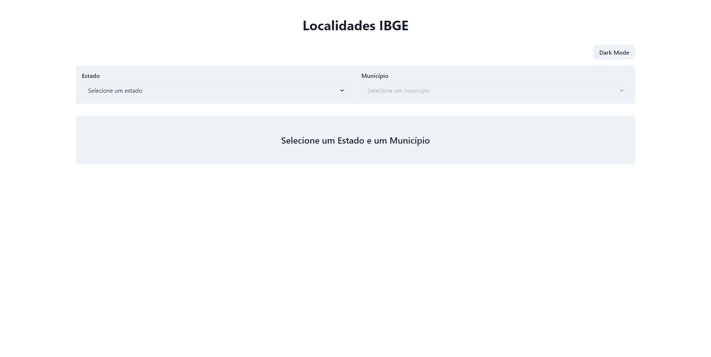
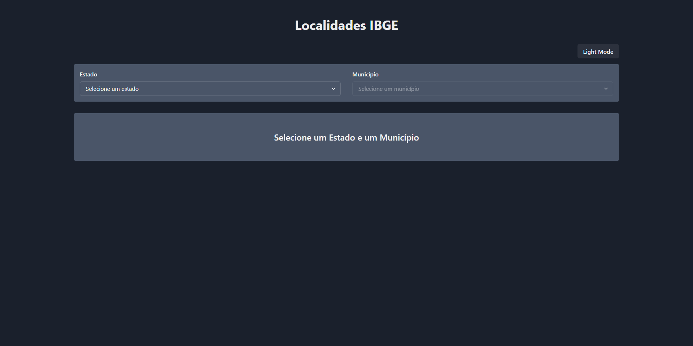
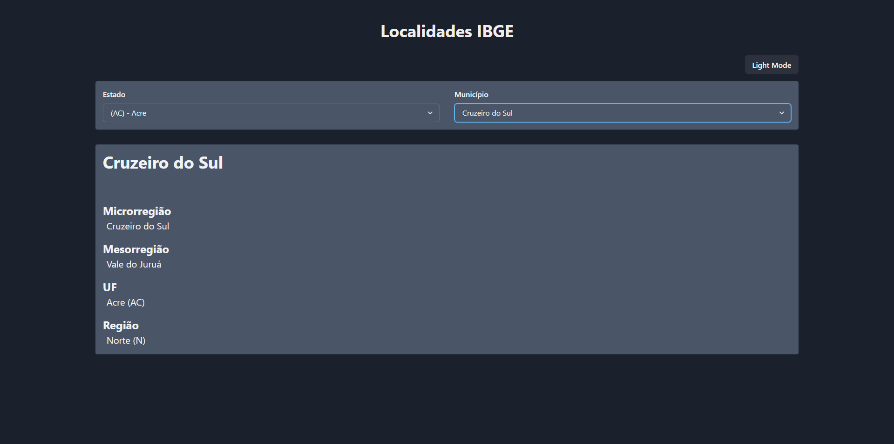

# Localidades IBGE

A aplicação foi desenvolvida com React e consome a API de dados de localidades do IBGE ([https://servicodados.ibge.gov.br/api/docs/localidades](https://servicodados.ibge.gov.br/api/docs/localidades)
). Foi utilizada a biblioteca de componentes visuais Chackra UI, e o Redux para gerenciamento de estados globais.

Disponível em: [https://peaceful-dubinsky-19bf20.netlify.app/](https://peaceful-dubinsky-19bf20.netlify.app/)

## Captura de tela

  

  

  

